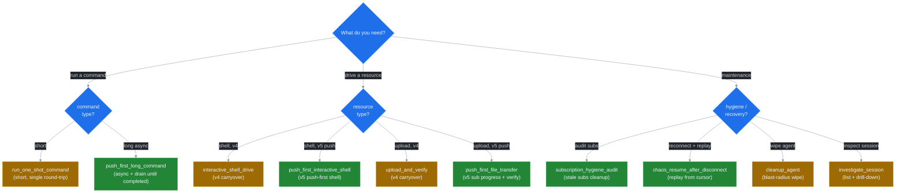

# Prompts Catalog

The ten canonical workflows advertised via `prompts/list` in v5.0. Five carry over from v4 and five are new in v5.0. Source: [ADR 0005](../adr/0005-llm-ux-priorities.md). The Phase 3 implementation in `src/infra/mcp/prompts.rs` will materialise these entries; this file is the spec.

Each entry records description, arguments, expected event sequence, failure modes, and (for the v5.0 entries that involve subscriptions) an example NDJSON exchange routed through `ssh-mcp-tail daemon`. NDJSON examples assume the daemon mode defined by [ADR 0008](../adr/0008-ndjson-daemon-protocol.md) and are forthcoming behaviour for Phase 4.



## Carryovers from v4

The five prompts that already ship in v4 keep their semantics. v5.0 only modifies their description text to align with [`GOLDEN_RULES.md`](./GOLDEN_RULES.md).

### `run_one_shot_command` (v4 carryover)

**Description.** Drive `ssh_run` with `reuse=auto` and `disconnect_after=true` to execute a short command and immediately release the session.

**Arguments.**

- `address` (string, required): SSH host (`host` or `host:port`).
- `username` (string, required): SSH login user.
- `command` (string, required): shell command to execute.

**Expected event sequence.** `ssh_run` ack on stdout (the markdown body carries the result). Single round-trip; no push channel.

**Failure modes.**

- `[AUTH_FAILED]` — credentials wrong; never retry.
- `[CONNECTION_FAILED]` / `[CONNECTION_TIMEOUT]` — TRANSPORT class; auto-retry with backoff.
- `[REMOTE_CMD_FAILED]` — command exited non-zero; LLM judges based on `exit_code`.

### `investigate_session` (v4 carryover)

**Description.** Snapshot async commands on a known session, read the session health resource, then disconnect.

**Arguments.**

- `session_id` (string, required): the `_ID` returned by `ssh_connect`.

**Expected event sequence.** `ssh_list_commands` returns the catalogue; `resources/read session://<id>/health` returns the health snapshot; `ssh_disconnect` releases the session.

**Failure modes.**

- `[SESSION_NOT_FOUND]` — RESOURCE class; never retry. Use `ssh_list_sessions` to find the live id.

### `upload_and_verify` (v4 carryover)

**Description.** Run `ssh_upload`, wait for completion, then `ssh_run sha256sum` on the remote path.

**Arguments.**

- `address`, `username` (strings, required): see `run_one_shot_command`.
- `local_path` (string, required): source path on the local filesystem.
- `remote_path` (string, required): destination path on the remote host.

**Expected event sequence.** `ssh_upload` returns `transfer_id`; `ssh_get_transfer_progress(wait=true)` waits for completion; `ssh_run sha256sum <remote_path>` verifies. v5.0 prompts callers to subscribe `transfer://<tid>/progress` instead of polling — see `push_first_file_transfer` below.

**Failure modes.**

- `[SFTP_ERROR]` — REMOTE class; LLM judges (e.g. permission denied vs disk full).
- `[TRANSFER_NOT_FOUND]` — RESOURCE; never retry.

### `interactive_shell_drive` (v4 carryover)

**Description.** Open a shell, subscribe to its output, wait for the prompt pattern, then drive it.

**Arguments.**

- `session_id` (string, required).
- `prompt_pattern` (string, required): regex marking the shell prompt (e.g. `\$\s$`).
- `command` (string, required): the line to write once the prompt is seen.

**Expected event sequence.** `ssh_shell_open` -> `resources/subscribe shell://<sid>/output` -> `ssh_shell_wait_for(pattern)` -> `ssh_shell_write(command)` -> consume push events -> `ssh_shell_close`.

**Failure modes.**

- `[SHELL_NOT_FOUND]` — RESOURCE; never retry.
- `[INVALID_REPEAT]` — STATE; argument out of range.

### `cleanup_agent` (v4 carryover)

**Description.** Call `ssh_disconnect_agent` against the supplied `agent_id` to wipe every session and resource the agent owns.

**Arguments.**

- `agent_id` (string, required): the agent identifier passed at `ssh_connect`.

**Expected event sequence.** Single tool call; idempotent. Markdown body lists `disconnected_count`.

**Failure modes.**

- None retryable. The call is idempotent — duplicate invocations succeed with `disconnected_count=0`.

## New in v5.0

The five new prompts encode the push-first invariants described in [ADR 0005](../adr/0005-llm-ux-priorities.md). They depend on the channel mux ([ADR 0004](../adr/0004-channel-mux-fairness.md)) and the lifecycle binding ([ADR 0003](../adr/0003-lifecycle-binding.md)).

### `push_first_long_command` (v5.0 NEW)

**Description.** Execute a long-running async command with subscription-based event drain. Resource auto-closes when the last subscriber drops.

**Arguments.**

- `session_id` (string, required).
- `command` (string, required): the shell command to run.
- `lag_policy` (string, optional, default `"snapshot"`): one of `block_slow | drop_oldest | drop_newest | snapshot`.

**Expected event sequence.** `ssh_execute(release_when_no_subs=true)` returns `command_id` -> `ssh_subscribe(uri=command://<cid>/output, lifetime=auto-close, lag_policy=<arg>)` returns `sub_id` -> push events arrive (`ev=push`) until `ev=completed{exit:N}`.

**Failure modes.**

- `[SUB_LEAK_RISK]` — POLICY (warn). Triggered if the caller skipped the subscribe and `release_when_no_subs=true` was not set; switch to either path.
- `[LANE_BUFFER_FULL]` — POLICY (conditional). Increase `SSH_LANE_BUFFER` or move to `lag_policy=snapshot`.
- `[REMOTE_CMD_FAILED]` — REMOTE; the exit code is in `ev=completed`.

**Example NDJSON exchange (daemon mode).**

```ndjson
{"op":"exec","sid":"sess-1","cmd":"top -b -n 30","release_when_no_subs":true,"id":"corr-1"}
{"ev":"started","cid":"cmd-1","sid":"sess-1","id":"corr-1"}
{"op":"subscribe","uri":"command://cmd-1/output","lifetime":"auto-close","lag_policy":"snapshot","id":"corr-2"}
{"ev":"ack","sub_id":"sub-1","id":"corr-2"}
{"ev":"push","sub_id":"sub-1","uri":"command://cmd-1/output","seq_local":1,"seq_global":42,"cursor":120,"delta":"top - 14:32:07..."}
{"ev":"completed","cid":"cmd-1","exit":0}
{"ev":"resource_closed","uri":"command://cmd-1/output","reason":"unsubscribe_grace_elapsed"}
```

### `push_first_interactive_shell` (v5.0 NEW)

**Description.** Open a PTY shell, subscribe before writing, drive it via `ssh_shell_write` / `ssh_shell_send_key`, synchronise on `ssh_shell_wait_for`. Resource auto-closes when the last subscriber drops.

**Arguments.**

- `session_id` (string, required).
- `prompt_pattern` (string, required): regex for the shell prompt.
- `script` (array of strings, required): one entry per line to write between waits.

**Expected event sequence.** `ssh_shell_open(release_when_no_subs=true)` -> `ssh_subscribe(uri=shell://<sid>/output, lifetime=auto-close)` -> for each script line: `ssh_shell_wait_for(prompt_pattern)` -> `ssh_shell_write(line)` -> consume push events. Final `ssh_unsubscribe` is optional under `lifetime=auto-close`.

**Failure modes.**

- `[SHELL_NOT_FOUND]` — RESOURCE; never retry.
- `[SUB_LEAK_RISK]` — POLICY (warn) if the caller delays the subscribe past `SSH_SUB_LEAK_RISK_WARN_S` (default 2 s).
- `[LAG_DETECTED]` / `[LAG_BACKPRESSURE]` — POLICY; tune `lag_policy` or consume faster.

**Example NDJSON exchange.**

```ndjson
{"op":"shell_open","sid":"sess-1","release_when_no_subs":true,"id":"corr-1"}
{"ev":"ack","shid":"sh-1","initial_buffer":"root@host:~# ","id":"corr-1"}
{"op":"subscribe","uri":"shell://sh-1/output","lifetime":"auto-close","id":"corr-2"}
{"ev":"ack","sub_id":"sub-1","id":"corr-2"}
{"op":"shell_write","shid":"sh-1","bytes":"uptime\n","id":"corr-3"}
{"ev":"push","sub_id":"sub-1","seq_local":1,"cursor":48,"delta":"uptime\n14:32:07 up 7 days...\nroot@host:~# "}
{"op":"unsubscribe","sub_id":"sub-1","id":"corr-4"}
{"ev":"resource_closed","uri":"shell://sh-1/output","reason":"unsubscribe_grace_elapsed"}
```

### `push_first_file_transfer` (v5.0 NEW)

**Description.** Upload a file with subscription-based progress visibility. Verifies remotely when the transfer completes.

**Arguments.**

- `session_id` (string, required).
- `local_path` (string, required).
- `remote_path` (string, required).
- `verify` (boolean, optional, default `true`): when true, run `sha256sum` after completion.

**Expected event sequence.** `ssh_upload(release_when_no_subs=true)` -> `ssh_subscribe(uri=transfer://<tid>/progress, lifetime=auto-close)` -> consume `ev=transfer_progress` events until `bytes_transferred == total_bytes` -> optional `ssh_run sha256sum <remote_path>`.

**Failure modes.**

- `[SFTP_ERROR]` — REMOTE; permission / disk / quota failures.
- `[TRANSFER_NOT_FOUND]` — RESOURCE; never retry.
- `[RING_BUFFER_OVERFLOW]` — POLICY (recover); rare for transfers because the buffer holds checkpointed bytes_transferred values.

**Example NDJSON exchange.**

```ndjson
{"op":"upload","sid":"sess-1","local":"/tmp/img.iso","remote":"/srv/img.iso","release_when_no_subs":true,"id":"corr-1"}
{"ev":"ack","tid":"xfer-1","total_bytes":104857600,"id":"corr-1"}
{"op":"subscribe","uri":"transfer://xfer-1/progress","lifetime":"auto-close","id":"corr-2"}
{"ev":"transfer_progress","tid":"xfer-1","bytes":1048576,"total":104857600}
{"ev":"transfer_progress","tid":"xfer-1","bytes":52428800,"total":104857600}
{"ev":"transfer_progress","tid":"xfer-1","bytes":104857600,"total":104857600}
{"ev":"resource_closed","uri":"transfer://xfer-1/progress","reason":"completed"}
```

### `subscription_hygiene_audit` (v5.0 NEW)

**Description.** Enumerate every active `sub_id` known to the daemon, surface stale subscriptions, and unsubscribe the leakers.

**Arguments.**

- `agent_id` (string, optional): when supplied, restrict the audit to subscriptions owned by the agent.
- `stale_threshold_secs` (integer, optional, default 60): age in seconds beyond which a sub with `events_sent==0` is considered leaked.

**Expected event sequence.** `ssh_sub_list` returns every sub with summary stats -> client identifies stale subs (no events delivered, age > threshold) -> for each stale sub, `ssh_unsubscribe(sub_id)`.

**Failure modes.**

- `[SUB_NOT_FOUND]` — RESOURCE; the sub was already cleaned. Treat as success.

**Example NDJSON exchange.**

```ndjson
{"op":"sub_list","id":"corr-1"}
{"ev":"ack","subs":[{"sub_id":"sub-1","uri":"shell://sh-1/output","events_sent":0,"age_s":120},{"sub_id":"sub-2","uri":"command://cmd-9/output","events_sent":34,"age_s":15}],"id":"corr-1"}
{"op":"unsubscribe","sub_id":"sub-1","id":"corr-2"}
{"ev":"ack","sub_id":"sub-1","id":"corr-2"}
```

### `chaos_resume_after_disconnect` (v5.0 NEW)

**Description.** Reconnect after an unexpected transport drop and replay the lost segment of a known resource from a recorded cursor. Useful for long shells or audit-log streams that survive transient host crashes.

**Arguments.**

- `address`, `username` (strings, required).
- `agent_id` (string, required): same agent_id used in the prior session so refcount cascade matches.
- `uri` (string, required): the resource URI to resume.
- `from_cursor` (integer, required): the last cursor value the client confirmed.

**Expected event sequence.** `ssh_connect` (the prior session may already be live; `reuse=Auto` short-circuits) -> `ssh_subscribe(uri, lifetime=auto-close)` returns a new `sub_id` -> `ssh_sub_replay(sub_id, from_cursor)` re-emits buffered events from the cursor -> consumer drains forward.

**Failure modes.**

- `[RESOURCE_GONE]` — RESOURCE; never retry. The remote resource was released during the disconnect window. Recreate via `ssh_shell_open` / `ssh_execute` and resume from a fresh cursor.
- `[RING_BUFFER_OVERFLOW]` — POLICY (recover). The cursor predates the available window; the server emits a snapshot and adjusts the cursor forward. Consumer must accept the gap or extend `SSH_SHELL_MAX_BUFFER`.

**Example NDJSON exchange.**

```ndjson
{"op":"connect","host":"vm.example.com","user":"root","agent_id":"agent-A","reuse":"auto","id":"corr-1"}
{"ev":"ack","sid":"sess-2","reused":true,"id":"corr-1"}
{"op":"subscribe","uri":"shell://sh-1/output","lifetime":"auto-close","id":"corr-2"}
{"ev":"ack","sub_id":"sub-9","id":"corr-2"}
{"op":"sub_replay","sub_id":"sub-9","from_cursor":48,"id":"corr-3"}
{"ev":"push","sub_id":"sub-9","seq_local":1,"cursor":120,"delta":"<replayed bytes>"}
{"ev":"push","sub_id":"sub-9","seq_local":2,"cursor":256,"delta":"<delta after replay>"}
```

## Cross-references

- [`GOLDEN_RULES.md`](./GOLDEN_RULES.md) — the invariants every prompt enforces.
- [`ANTIPATTERNS.md`](./ANTIPATTERNS.md) — what these prompts protect against.
- [`ERROR_HANDBOOK.md`](./ERROR_HANDBOOK.md) — every code surfaced in the failure-modes section.
- [ADR 0008](../adr/0008-ndjson-daemon-protocol.md) — full NDJSON schema for the daemon-mode examples.
