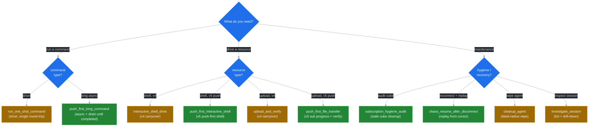

# Prompts Catalog

Spec for the 10 workflows advertised via `prompts/list` in v5.0 — 5 v4 carryovers plus 5 v5 push-first additions. Source: [ADR 0005](../adr/0005-llm-ux-priorities.md). Phase 3 materialises these in `src/infra/mcp/prompts.rs`.

Each entry: description, arguments, expected event sequence, failure modes, and (for v5 sub-aware prompts) an example NDJSON exchange routed through `ssh-mcp-tail daemon` (see [ADR 0008](../adr/0008-ndjson-daemon-protocol.md)).



## Carryovers from v4

These five ship in v4 and keep their semantics. v5.0 only updates the description text to align with [GOLDEN_RULES.md](./GOLDEN_RULES.md).

### `run_one_shot_command`

Drive `ssh_run` with `reuse=auto` and `disconnect_after=true` to execute a short command and release the session.

- **Args**: `address`, `username`, `command` (all required strings).
- **Sequence**: `ssh_run` ack on stdout (markdown body carries the result). Single round-trip; no push channel.
- **Failure modes**: `[AUTH_FAILED]` (never retry); `[CONNECTION_FAILED]` / `[CONNECTION_TIMEOUT]` (TRANSPORT, auto-retry with backoff); `[REMOTE_CMD_FAILED]` (LLM judges based on `exit_code`).

### `investigate_session`

Snapshot async commands on a known session, read its health resource, then disconnect.

- **Args**: `session_id` (required).
- **Sequence**: `ssh_list_commands` → `resources/read session://<id>/health` → `ssh_disconnect`.
- **Failure modes**: `[SESSION_NOT_FOUND]` (RESOURCE, never retry; use `ssh_list_sessions` to find the live id).

### `upload_and_verify`

Run `ssh_upload`, wait for completion, then `ssh_run sha256sum` on the remote path.

- **Args**: `address`, `username`, `local_path`, `remote_path` (all required).
- **Sequence**: `ssh_upload` → `ssh_get_transfer_progress(wait=true)` → `ssh_run sha256sum <remote_path>`. v5.0 prefers `push_first_file_transfer` (subscribe instead of poll).
- **Failure modes**: `[SFTP_ERROR]` (REMOTE; e.g. permission denied vs disk full); `[TRANSFER_NOT_FOUND]` (RESOURCE).

### `interactive_shell_drive`

Open a shell, subscribe to its output, wait for the prompt pattern, then drive it.

- **Args**: `session_id`, `prompt_pattern` (regex, e.g. `\$\s$`), `command` (all required).
- **Sequence**: `ssh_shell_open` → `resources/subscribe shell://<sid>/output` → `ssh_shell_wait_for(pattern)` → `ssh_shell_write(command)` → consume push events → `ssh_shell_close`.
- **Failure modes**: `[SHELL_NOT_FOUND]` (RESOURCE); `[INVALID_REPEAT]` (STATE — out of range).

### `cleanup_agent`

Call `ssh_disconnect_agent(agent_id)` to wipe every session and resource the agent owns.

- **Args**: `agent_id` (required).
- **Sequence**: single idempotent tool call; markdown body lists `disconnected_count`.
- **Failure modes**: none retryable; duplicate invocations succeed with `disconnected_count=0`.

## New in v5.0

These five encode the push-first invariants from [ADR 0005](../adr/0005-llm-ux-priorities.md), backed by the channel mux ([ADR 0004](../adr/0004-channel-mux-fairness.md)) and lifecycle binding ([ADR 0003](../adr/0003-lifecycle-binding.md)).

### `push_first_long_command`

Execute a long-running async command with subscription-based event drain. Resource auto-closes when the last subscriber drops.

- **Args**: `session_id`, `command` (required); `lag_policy` (default `"snapshot"`, one of `block_slow | drop_oldest | drop_newest | snapshot`).
- **Sequence**: `ssh_execute(release_when_no_subs=true)` → `ssh_subscribe(uri=command://<cid>/output, lifetime=auto-close, lag_policy=<arg>)` → push events until `ev=completed{exit:N}`.
- **Failure modes**: `[SUB_LEAK_RISK]` (POLICY, warn — subscribe missing and `release_when_no_subs=true` not set); `[LANE_BUFFER_FULL]` (raise `SSH_LANE_BUFFER` or switch to `snapshot`); `[REMOTE_CMD_FAILED]` (exit code in `ev=completed`).

```ndjson
{"op":"exec","sid":"sess-1","cmd":"top -b -n 30","release_when_no_subs":true,"id":"corr-1"}
{"ev":"started","cid":"cmd-1","sid":"sess-1","id":"corr-1"}
{"op":"subscribe","uri":"command://cmd-1/output","lifetime":"auto-close","lag_policy":"snapshot","id":"corr-2"}
{"ev":"ack","sub_id":"sub-1","id":"corr-2"}
{"ev":"push","sub_id":"sub-1","uri":"command://cmd-1/output","seq_local":1,"seq_global":42,"cursor":120,"delta":"top - 14:32:07..."}
{"ev":"completed","cid":"cmd-1","exit":0}
{"ev":"resource_closed","uri":"command://cmd-1/output","reason":"unsubscribe_grace_elapsed"}
```

### `push_first_interactive_shell`

Open a PTY shell, subscribe before writing, drive it via `ssh_shell_write` / `ssh_shell_send_key`, synchronise on `ssh_shell_wait_for`. Resource auto-closes when the last subscriber drops.

- **Args**: `session_id`, `prompt_pattern` (regex), `script` (array of strings — one per line to write between waits).
- **Sequence**: `ssh_shell_open(release_when_no_subs=true)` → `ssh_subscribe(uri=shell://<sid>/output, lifetime=auto-close)` → for each script line: `ssh_shell_wait_for(prompt_pattern)` → `ssh_shell_write(line)` → consume push events. Final `ssh_unsubscribe` is optional under `lifetime=auto-close`.
- **Failure modes**: `[SHELL_NOT_FOUND]` (RESOURCE); `[SUB_LEAK_RISK]` (subscribe delayed past `SSH_SUB_LEAK_RISK_WARN_S`); `[LAG_DETECTED]` / `[LAG_BACKPRESSURE]` (tune `lag_policy` or consume faster).

```ndjson
{"op":"shell_open","sid":"sess-1","release_when_no_subs":true,"id":"corr-1"}
{"ev":"ack","shid":"sh-1","initial_buffer":"root@host:~# ","id":"corr-1"}
{"op":"subscribe","uri":"shell://sh-1/output","lifetime":"auto-close","id":"corr-2"}
{"ev":"ack","sub_id":"sub-1","id":"corr-2"}
{"op":"shell_write","shid":"sh-1","bytes":"uptime\n","id":"corr-3"}
{"ev":"push","sub_id":"sub-1","seq_local":1,"cursor":48,"delta":"uptime\n14:32:07 up 7 days...\nroot@host:~# "}
{"op":"unsubscribe","sub_id":"sub-1","id":"corr-4"}
{"ev":"resource_closed","uri":"shell://sh-1/output","reason":"unsubscribe_grace_elapsed"}
```

### `push_first_file_transfer`

Upload a file with subscription-based progress visibility; verify remotely when the transfer completes.

- **Args**: `session_id`, `local_path`, `remote_path` (required); `verify` (default `true` — runs `sha256sum` after completion).
- **Sequence**: `ssh_upload(release_when_no_subs=true)` → `ssh_subscribe(uri=transfer://<tid>/progress, lifetime=auto-close)` → consume `ev=transfer_progress` until `bytes_transferred == total_bytes` → optional `ssh_run sha256sum <remote_path>`.
- **Failure modes**: `[SFTP_ERROR]` (REMOTE — permission / disk / quota); `[TRANSFER_NOT_FOUND]` (RESOURCE); `[RING_BUFFER_OVERFLOW]` (rare — buffer holds checkpointed bytes_transferred values).

```ndjson
{"op":"upload","sid":"sess-1","local":"/tmp/img.iso","remote":"/srv/img.iso","release_when_no_subs":true,"id":"corr-1"}
{"ev":"ack","tid":"xfer-1","total_bytes":104857600,"id":"corr-1"}
{"op":"subscribe","uri":"transfer://xfer-1/progress","lifetime":"auto-close","id":"corr-2"}
{"ev":"transfer_progress","tid":"xfer-1","bytes":1048576,"total":104857600}
{"ev":"transfer_progress","tid":"xfer-1","bytes":52428800,"total":104857600}
{"ev":"transfer_progress","tid":"xfer-1","bytes":104857600,"total":104857600}
{"ev":"resource_closed","uri":"transfer://xfer-1/progress","reason":"completed"}
```

### `subscription_hygiene_audit`

Enumerate every active `sub_id`, surface stale subscriptions, unsubscribe the leakers.

- **Args**: `agent_id` (optional — restrict to subs owned by the agent); `stale_threshold_secs` (default 60 — age beyond which a sub with `events_sent==0` is considered leaked).
- **Sequence**: `ssh_sub_list` → client filters stale subs → `ssh_unsubscribe(sub_id)` for each.
- **Failure modes**: `[SUB_NOT_FOUND]` — sub already cleaned; treat as success.

```ndjson
{"op":"sub_list","id":"corr-1"}
{"ev":"ack","subs":[{"sub_id":"sub-1","uri":"shell://sh-1/output","events_sent":0,"age_s":120},{"sub_id":"sub-2","uri":"command://cmd-9/output","events_sent":34,"age_s":15}],"id":"corr-1"}
{"op":"unsubscribe","sub_id":"sub-1","id":"corr-2"}
{"ev":"ack","sub_id":"sub-1","id":"corr-2"}
```

### `chaos_resume_after_disconnect`

Reconnect after an unexpected transport drop and replay the lost segment of a known resource from a recorded cursor. Useful for long shells or audit-log streams that survive transient host crashes.

- **Args**: `address`, `username`, `agent_id` (same as prior session — refcount cascade matches), `uri`, `from_cursor` (last confirmed cursor).
- **Sequence**: `ssh_connect` (`reuse=Auto` short-circuits if the prior session is live) → `ssh_subscribe(uri, lifetime=auto-close)` → `ssh_sub_replay(sub_id, from_cursor)` re-emits buffered events → consumer drains forward.
- **Failure modes**: `[RESOURCE_GONE]` (RESOURCE — released during disconnect window; recreate via `ssh_shell_open` / `ssh_execute` and resume from a fresh cursor); `[RING_BUFFER_OVERFLOW]` (POLICY, recover — cursor predates the available window; server emits a snapshot and adjusts cursor forward; accept the gap or extend `SSH_SHELL_MAX_BUFFER`).

```ndjson
{"op":"connect","host":"vm.example.com","user":"root","agent_id":"agent-A","reuse":"auto","id":"corr-1"}
{"ev":"ack","sid":"sess-2","reused":true,"id":"corr-1"}
{"op":"subscribe","uri":"shell://sh-1/output","lifetime":"auto-close","id":"corr-2"}
{"ev":"ack","sub_id":"sub-9","id":"corr-2"}
{"op":"sub_replay","sub_id":"sub-9","from_cursor":48,"id":"corr-3"}
{"ev":"push","sub_id":"sub-9","seq_local":1,"cursor":120,"delta":"<replayed bytes>"}
{"ev":"push","sub_id":"sub-9","seq_local":2,"cursor":256,"delta":"<delta after replay>"}
```

## Cross-references

- [`GOLDEN_RULES.md`](./GOLDEN_RULES.md) — the invariants every prompt enforces.
- [`ANTIPATTERNS.md`](./ANTIPATTERNS.md) — what these prompts protect against.
- [`ERROR_HANDBOOK.md`](./ERROR_HANDBOOK.md) — every code surfaced in the failure-modes section.
- [ADR 0008](../adr/0008-ndjson-daemon-protocol.md) — full NDJSON schema for the daemon-mode examples.
