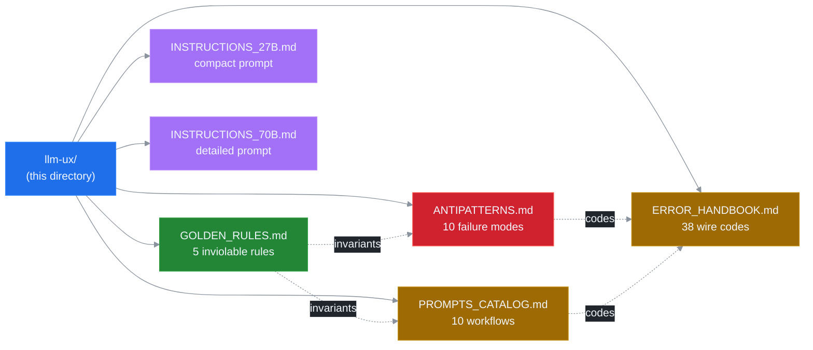

# LLM UX Reference (`docs/llm-ux/`)

This directory is the canonical surface that ssh-mcp v5.0 exposes to LLM hosts and to humans who reason about LLM-driven workflows. It is consumed in three ways:

- A 27B-class model reads the short root prompt embedded in `Implementation.instructions` (sourced from `INSTRUCTIONS_27B.md`) and stops there.
- A 70B-class model reads the longer prompt (sourced from `INSTRUCTIONS_70B.md`) and consults the prompt catalog or error handbook on demand.
- An operator or contributor reads any file directly to debug a leak, classify a wire error, or onboard onto v5 invariants.

Forward-looking note. The files here describe the v5.0 design defined by ADRs 0003–0008. Phase 1 has landed the lifecycle layer with v4-compatible defaults. Phases 2–6 wire the channel mux, expose the new tool surface, ship the NDJSON daemon, and align the documentation. Sections that describe a tool, an op, or a code that is not yet wired are clearly marked v5.0 forthcoming.

## File index

- [`GOLDEN_RULES.md`](./GOLDEN_RULES.md) — five inviolable rules from [ADR 0005](../adr/0005-llm-ux-priorities.md) with rationale, a violation example, and the compliant alternative.
- [`INSTRUCTIONS_27B.md`](./INSTRUCTIONS_27B.md) — compact root prompt (≤2000 chars, fragments OK) intended for `Implementation.instructions` when the host signals a 27B-class model.
- [`INSTRUCTIONS_70B.md`](./INSTRUCTIONS_70B.md) — detailed root prompt (≤6000 chars) for ≥70B-class models. Adds tradeoffs for `lifetime`, `lag_policy`, and cleanup.
- [`PROMPTS_CATALOG.md`](./PROMPTS_CATALOG.md) — spec for the 10 prompts published via `prompts/list` (5 v4 carryovers + 5 v5.0 additions). Source of truth for the Phase 3 implementation.
- [`ANTIPATTERNS.md`](./ANTIPATTERNS.md) — 10 documented failure modes (hot-poll, leak, cascade, lag-blindness, …) with symptom, consequence, fix, and detection signal.
- [`ERROR_HANDBOOK.md`](./ERROR_HANDBOOK.md) — the canonical reference for the 38 wire codes defined by [ADR 0007](../adr/0007-error-taxonomy.md), grouped by category, with retry policy, cure, prevention, and an NDJSON example per code.

## Driving ADRs

These ADRs are the source of truth. Read them when this directory is ambiguous or when you need the rationale.

- [ADR 0003 — Lifecycle Binding](../adr/0003-lifecycle-binding.md) — the refcount + grace-timer state machine.
- [ADR 0004 — Channel Mux + SubId](../adr/0004-channel-mux-fairness.md) — per-subscriber isolation.
- [ADR 0005 — LLM UX Priorities](../adr/0005-llm-ux-priorities.md) — why this directory exists.
- [ADR 0006 — Backpressure Policies](../adr/0006-backpressure-policies.md) — the four `LagPolicy` variants.
- [ADR 0007 — Error Taxonomy](../adr/0007-error-taxonomy.md) — every code, every category.

## How to use this directory

| Question | Read this first |
|---|---|
| "What is the v5.0 root prompt for my 27B-class model?" | [`INSTRUCTIONS_27B.md`](./INSTRUCTIONS_27B.md) |
| "What is the v5.0 root prompt for my ≥70B-class model?" | [`INSTRUCTIONS_70B.md`](./INSTRUCTIONS_70B.md) |
| "Which rules must my host or my LLM never break?" | [`GOLDEN_RULES.md`](./GOLDEN_RULES.md) |
| "Which workflow should I bind to a slash command?" | [`PROMPTS_CATALOG.md`](./PROMPTS_CATALOG.md) |
| "My host emitted a leak. Which anti-pattern is this?" | [`ANTIPATTERNS.md`](./ANTIPATTERNS.md) |
| "I see `[CODE]` on the wire. What does it mean?" | [`ERROR_HANDBOOK.md`](./ERROR_HANDBOOK.md) |
| "Why was the design chosen this way?" | the ADRs above |

For protocol-level details (NDJSON op schema, daemon framing) consult `docs/INSTRUCTIONS_DAEMON.md` (Phase 6) and the JSON schema at `docs/api/ssh-mcp-ndjson.schema.json`.
